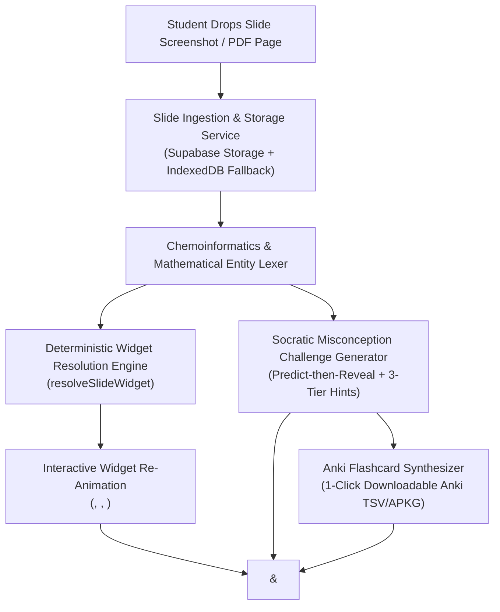

# Phase 10 Context: Pillar 2 Fotokopiden Etkileşime (Dynamic Slide Re-Animator)

## User Intent & Product Goal
Empower Turkish pharmacy students (Marmara, Hacettepe, Istanbul syllabi) to drop static lecture photocopies (*"fotokopi"*), slide screenshots, and GoodNotes PDFs into PharmLearn and **instantly transform them into an interactive learning station**:
1. Mount a calibrated biophysical/chemical interactive widget (e.g. Henderson-Hasselbalch ionization slider, dose-response curve, SAR local anesthetic matrix, or 3D chemical structure viewer).
2. Generate Socratic active-recall challenges with predict-then-reveal hypothesis locking and 3-tier scaffolding hint ladders mapped to canonical exam traps (`TRAP-01` to `TRAP-10`).
3. Provide a 1-click Anki export (`.txt` formatted for Anki Desktop / AnkiMobile) with cloze-deletion cards, hint ladders, and slide provenance.
4. **Storage & Hosting Architecture**: In alignment with direct user guidance ("no need we can host them its ot that serious i going to grt ythe necesarry permissions"), slide uploads and generated artifacts are persisted in Supabase Storage (`slides` / `documents` bucket) with robust offline-first fallback (IndexedDB / localStorage), enabling students to re-open past re-animated slides and preserve their workspace across devices.

---

## Technical Architecture & Invariants

### 1. Deterministic Widget Resolution Heuristics
- **Acid-Base & Ion Trapping** (keywords: `pKa`, `pH`, `Henderson-Hasselbalch`, `iyonlaşma`, `asit`, `baz`):
  - Resolves to `<IonizationEquilibriumSlider />` or `<IonizationChamber />`.
- **Dose-Response & Receptor Dynamics** (keywords: `Kd`, `EC50`, `Emax`, `Schild`, `agonist`, `antagonist`, `yedek reseptör`):
  - Resolves to `<DoseResponseCurve />` or `<ReceptorOperationalModel />`.
- **SAR & Scaffolds** (keywords: `SAR`, `lokal anestezik`, `prokain`, `dibukain`, `ester`, `amit`, `organofosfat`, `asetilkolinesteraz`):
  - Resolves to `<DualModeMoleculeViewer />` or `<SarExplorer />`.
- **Receptor-Ligand / Enzyme Specificity** (keywords: `reseptör`, `ligand`, `G-protein`, `AChE`, `enzim`):
  - Resolves to `<ReceptorLigandMatcher />` or `<MembranePartitionSimulator />`.

### 2. Socratic Active-Recall Generator with Canonical Misconception Traps
- **Predict-then-Reveal Lock**: Hypothesis must be registered or confirmed before question options unlock.
- **Distractor Decontamination**: All distractors represent specific 3rd-year pharmacy misconceptions (`TRAP-01` through `TRAP-10`).
- **3-Tier Scaffolding Hint Ladder**: Tier 1 (Nudge) $\to$ Tier 2 (Clue) $\to$ Tier 3 (Solution).

### 3. Anki Export Engine
- Formatted with standard Anki import headers (`#separator:tab`, `#html:true`, `#tags column:4`).
- Cards contain question, answer, 3-tier hint ladder, exam trap warning, and slide provenance.
- Clean UTF-8 download triggered via browser Blob anchor.
