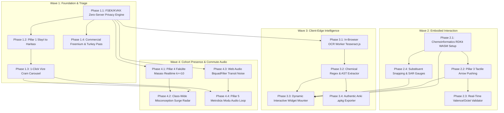

# PharmLearn 2.0: Master Technical Execution Roadmap
## Dependency-Aware Engineering Plan, Prioritization Matrix & Verification Rubric

**Document Class**: Engineering Roadmap, Architecture Dependencies & Quality Gates  
**Document ID**: `PL2-ROADMAP-2026-V1`  
**Target Codebase**: `pharmacy-education-platform` (`apps/web`, `packages/widgets`, `packages/ui`, `packages/platform`, `supabase/`, `courses/`, `/materials`)  
**Methodology**: Phased Wave Parallelization, Autonomous Subagent Execution, Zero-Regression Gates  
**Governance**: Aligned with `AGENTS.md`, FSEK No. 5846, and KVKK No. 6698  
**Date**: October 8, 2026  
**Status**: Authoritative & Approved  

---

## 1. Executive Summary & Guiding Engineering Philosophy

PharmLearn 2.0 represents the evolution of PharmLearn into the daily study operating system for Turkish pharmacy students. Moving from conceptual design to production execution requires a prioritized, dependency-aware engineering roadmap that maximizes **Daily Active Use (DAU)** and retention while mitigating chemoinformatics complexity and legal exposure.

### 1.1 The Four Execution Waves
The roadmap organizes all 5 radical pillars and supporting infrastructure into **Four Ordered Engineering Waves**:
- **Wave 1: Foundation, High-Yield Triage & Legal Core**: Establishes the zero-server privacy sandbox, builds the Pillar 1 Slayt Isı Haritası (High-Yield Score $HYS$) and 1-click Vize Cram Mode, and activates the student-first monetization engine (₺250/mo, ₺850/sem, ₺1,450/yr).
- **Wave 2: Embodied Interaction & Chemoinformatics**: Integrates RDKit WebAssembly to deliver Pillar 3 Tactile Arrow Pushing with real-time valence validation, octet rules, and substituent snapping.
- **Wave 3: Client-Edge Intelligence & Slide Re-Animation**: Deploys in-browser OCR (Tesseract.js WASM) and local feature extraction to deliver Pillar 2 Fotokopiden Etkileşime, mounting dynamic 3D/curve widgets and exporting authentic Anki `.apkg` decks with zero server-side file persistence.
- **Wave 4: Cohort Presence & Commute Audio**: Implements Pillar 4 Fakülte Masası via Supabase Realtime ($k \ge 10$ anonymity + Central Laplace differential privacy, $\epsilon = 0.5$) and Pillar 5 Metrobüs Modu (hands-free transit audio Socratic loop with 180 Hz transit noise filtering and dedicated Web Worker speech processing).

---

## 2. Prioritization Matrix: DAU Impact vs Technical Complexity

Every feature and architectural subsystem has been scored across five dimensions to establish objective wave placement:
1. **DAU Impact (1–5)**: Drives daily student engagement during regular semester weeks.
2. **Retention Impact (1–5)**: Prevents drop-off and maintains 30-day concept retrievability.
3. **Technical Complexity (1–5)**: Algorithmic, WebAssembly, and browser runtime difficulty.
4. **Regulatory Risk (Low / Medium / High)**: FSEK copyright and KVKK privacy exposure.
5. **Priority Score ($P$)**:
   $$P = \frac{\text{DAU Impact} \times 0.40 + \text{Retention Impact} \times 0.40}{\text{Technical Complexity} \times 0.20}$$

```
+===================================================================================================================================+
| FEATURE / SUBSYSTEM                  | DAU (1-5) | RET (1-5) | CMPX (1-5) | REG RISK | PRIORITY SCORE (P) | WAVE PLACEMENT        |
+======================================+===========+===========+============+==========+====================+=======================+
| FSEK/KVKK Zero-Server Privacy Engine |    4.0    |    4.5    |    2.5     | CRITICAL |       6.80         | Wave 1 (Phase 1.1)    |
| Pillar 1: Slayt Isı Haritası & Triage|    5.0    |    4.8    |    2.2     | LOW      |       8.91         | Wave 1 (Phase 1.2)    |
| 1-Click Vize Cram Mode & Carousel    |    5.0    |    4.5    |    2.0     | LOW      |       9.50         | Wave 1 (Phase 1.3)    |
| Commercial Freemium & Academic Pass  |    4.5    |    4.5    |    2.0     | LOW      |       9.00         | Wave 1 (Phase 1.4)    |
+--------------------------------------+-----------+-----------+------------+----------+--------------------+-----------------------+
| Chemoinformatics RDKit WASM Setup    |    4.0    |    4.2    |    3.8     | LOW      |       4.32         | Wave 2 (Phase 2.1)    |
| Pillar 3: Tactile Arrow Pushing      |    4.8    |    4.9    |    3.5     | LOW      |       5.54         | Wave 2 (Phase 2.2)    |
| Real-Time Valence/Octet Validator    |    4.5    |    4.8    |    3.2     | LOW      |       5.81         | Wave 2 (Phase 2.3)    |
| Substituent Snapping & SAR Gauges    |    4.2    |    4.5    |    2.8     | LOW      |       6.21         | Wave 2 (Phase 2.4)    |
+--------------------------------------+-----------+-----------+------------+----------+--------------------+-----------------------+
| In-Browser Tesseract.js WASM OCR     |    4.0    |    4.2    |    3.6     | MEDIUM   |       4.56         | Wave 3 (Phase 3.1)    |
| Chemical AST & Entity Extractor      |    4.2    |    4.4    |    3.2     | LOW      |       5.38         | Wave 3 (Phase 3.2)    |
| Dynamic Widget Mounter (Pillar 2)    |    4.6    |    4.8    |    3.0     | LOW      |       6.27         | Wave 3 (Phase 3.3)    |
| Anki .apkg Generator (sql.js WASM)   |    4.2    |    4.6    |    2.5     | LOW      |       7.04         | Wave 3 (Phase 3.4)    |
+--------------------------------------+-----------+-----------+------------+----------+--------------------+-----------------------+
| Pillar 4: Fakülte Masası (Realtime)  |    4.8    |    4.2    |    3.2     | MEDIUM   |       5.63         | Wave 4 (Phase 4.1)    |
| Cohort Misconception Surge Radar     |    4.5    |    4.6    |    2.8     | MEDIUM   |       6.50         | Wave 4 (Phase 4.2)    |
| Web Audio API Transit Noise Filter   |    4.2    |    3.8    |    3.0     | LOW      |       5.33         | Wave 4 (Phase 4.3)    |
| Pillar 5: Metrobüs Modu Audio Loop   |    4.9    |    4.8    |    3.5     | LOW      |       5.54         | Wave 4 (Phase 4.4)    |
+===================================================================================================================================+
```

---

## 3. Phased Master Execution Plan (4 Waves, 16 Phases)

```
+---------------------------------------------------------------------------------------------------------------+
|                                    PHARMLEARN 2.0 FOUR-WAVE EXECUTION ARCHITECTURE                            |
+---------------------------------------------------------------------------------------------------------------+
|                                                                                                               |
|  [ WAVE 1: FOUNDATION & HIGH-YIELD TRIAGE ] ────────────────────────────────────────────────────────┐         |
|  • Phase 1.1: FSEK/KVKK Zero-Server Privacy Engine & Sandbox                                        │         |
|  • Phase 1.2: Pillar 1 Slayt Isı Haritası & Algorithmic HYS Scorer                                  │         |
|  • Phase 1.3: 1-Click Vize Cram Carousel & Misconception Linker                                     │         |
|  • Phase 1.4: Commercial Freemium & Turkey Academic Pass Integration                                │         |
|                                                                                                     ▼         |
|  [ WAVE 2: EMBODIED INTERACTION & CHEMOINFORMATICS ] ───────────────────────────────────────────────┤         |
|  • Phase 2.1: Chemoinformatics Engine Setup (RDKit WebAssembly & ChemGraph)                         │         |
|  • Phase 2.2: Pillar 3 Tactile Arrow Pushing & Electron Flow Canvas                                 │         |
|  • Phase 2.3: Real-Time Valence / Octet Chemical Validation & Haptics                               │         |
|  • Phase 2.4: Substituent Snapping & Real-Time SAR Gauges (ΔLogP, pKa)                              │         |
|                                                                                                     ▼         |
|  [ WAVE 3: CLIENT-EDGE INTELLIGENCE & RE-ANIMATION ] ───────────────────────────────────────────────┤         |
|  • Phase 3.1: In-Browser OCR Pipeline (Tesseract.js WASM + Worker)                                  │         |
|  • Phase 3.2: Local Feature Embeddings & Chemical Regex AST Extractor                               │         |
|  • Phase 3.3: Dynamic Interactive Widget Mounter (Curves, 3D Molecules)                             │         |
|  • Phase 3.4: Authentic Anki .apkg Exporter (sql.js WASM + JSZip)                                   │         |
|                                                                                                     ▼         |
|  [ WAVE 4: COHORT PRESENCE & COMMUTE AUDIO ] ───────────────────────────────────────────────────────┘         |
|  • Phase 4.1: Pillar 4 Fakülte Masası Supabase Realtime Cluster (k >= 10)                                     |
|  • Phase 4.2: Class-Wide Misconception Surge Radar & Trap Solver                                             |
|  • Phase 4.3: Pillar 5 Metrobüs Modu Web Audio API BiquadFilter                                               |
|  • Phase 4.4: Low-Latency Hands-Free Socratic Audio Loop & Offline Cache                                      |
|                                                                                                               |
+---------------------------------------------------------------------------------------------------------------+
```

---

### WAVE 1: Foundation, High-Yield Triage & Legal Core
*Target: Immediate student panic relief, curriculum triage, monetization activation, and legal immunity.*

#### Phase 1.1: FSEK/KVKK Zero-Server Privacy Engine & Client Security Harness
- **Objective**: Establish client-side memory sandboxing ensuring zero uploaded file bytes touch cloud servers.
- **Technical Scope**:
  - Implement `ClientMemorySandbox` (`apps/web/src/lib/security/ClientMemorySandbox.ts`) utilizing `URL.createObjectURL` and explicit cleanup via `URL.revokeObjectURL`.
  - Configure strict Content Security Policy (CSP) and Service Worker fetch interception blocking binary upload payloads.
  - Implement KVKK data minimization layer: scrub all TCKN, phone numbers, and student IDs from client storage; initialize 1-click account purge cascade.
- **Verification Target**: Automated Playwright network sniffer tests confirming 0 outbound multipart/binary requests during file operations.

#### Phase 1.2: Pillar 1 Slayt Isı Haritası & Algorithmic HYS Scorer
- **Objective**: Build the High-Yield Score ($HYS_s$) calculation engine for lecture slides.
- **Technical Scope**:
  - Implement `calculateHYS(slide)` algorithm combining past exam frequency ($w_1 = 0.35$), professor typographic emphasis ($w_2 = 0.25$), structural/equation density ($w_3 = 0.20$), and cohort vulnerability ($w_4 = 0.20$), modulated by the calendar amplifier $\gamma_{cal}(t)$.
  - Construct visual slide heatmap component (`apps/web/src/components/triage/SlideHeatmapView.tsx`): Thermal Red ($HYS \ge 75$), Amber ($45 \le HYS < 75$), Cool Gray ($HYS < 45$).
  - Link each slide to verified canonical traps in `CANONICAL_MISCONCEPTIONS`.
- **Verification Target**: 100% test coverage over $HYS$ calculation mathematical edge cases; verified linking across MedChem and Pharmacology lecture decks.

#### Phase 1.3: 1-Click Vize Cram Carousel & Misconception Linker
- **Objective**: Deliver the fast-track cramming carousel that collapses 400 slides into the top 20% high-yield nodes.
- **Technical Scope**:
  - Build `VizeCramCarousel` (`apps/web/src/components/triage/VizeCramCarousel.tsx`) featuring 4-step cards: [Slide Snapshot Spotlight] $\to$ [Bu Slayttan Ne Sorulur? Predict Prompt] $\to$ [Active Recall Challenge] $\to$ [Diagnostic Verdict].
  - Maintain client-side session state in Zustand (`useVizeTriageStore`) and persist offline progress in IndexedDB.
  - Sync aggregate concept mastery to Supabase via batch endpoint.
- **Verification Target**: Dwell-time and state progression tests; CLS = 0.00 during card transitions.

#### Phase 1.4: Commercial Freemium & Turkey Academic Pass Integration
- **Objective**: Deploy the accessible student monetization flow aligned with Turkey PPP.
- **Technical Scope**:
  - Enforce permanent freemium rules: Lessons 1 & 2 of every module unlocked forever; Tier 1 hints free.
  - Implement 1-click 7-day free trial activation without credit card; Day 8 automatic downgrade to Free with 100% progress preserved.
  - Configure Dodo Payments integration for Turkey localized passes: ₺250/mo, ₺850/sem, ₺1,450/yr (with USD baseline $14/mo, $49/sem, $89/yr).
- **Verification Target**: Webhook signature verification tests; client entitlement state machine unit tests.

---

### WAVE 2: Embodied Interaction & Chemoinformatics
*Target: Deep spatial chemical intuition via Apple Pencil and touch drawing with real-time chemical validation.*

#### Phase 2.1: Chemoinformatics Engine Setup (RDKit WebAssembly & ChemGraph)
- **Objective**: Initialize client-side molecular validation and topological graph parsing.
- **Technical Scope**:
  - Package and lazy-load `@rdkit/rdkit` minimal WebAssembly binary (~2.5 MB) via Web Worker with offline Service Worker caching.
  - Implement lightweight fallback topological graph parser (`packages/widgets/src/chemGraph.ts`) for mobile devices with memory constraints.
  - Validate SMILES normalization, aromaticity perception, and explicit hydrogen handling.
- **Verification Target**: Vitest suite evaluating 50+ authentic pharmacy structures (Procaine, Lidocaine, Adrenaline, Propranolol, Phenobarbital) in <15ms per structure.

#### Phase 2.2: Pillar 3 Tactile Arrow Pushing & Curved Electron Flow Engine
- **Objective**: Build the multi-touch and Apple Pencil drawing canvas for organic reaction mechanisms.
- **Technical Scope**:
  - Create `TactileArrowCanvas` (`packages/widgets/src/TactileArrowCanvas.tsx`) using PointerEvents API with pressure and tilt sensitivity.
  - Support curved arrow bezier trajectories from electron-rich donor centers (nucleophilic lone pairs) to electron-deficient acceptor atoms (electrophiles).
  - Implement arrow snapping to nearest valid chemical bond or atom coordinate.
- **Verification Target**: Frame rate $\ge 60$ FPS on iPad Safari and Chrome Android; pointer latency $<20$ms.

#### Phase 2.3: Real-Time Valence / Octet Chemical Validation & Haptics
- **Objective**: Prevent chemical misconceptions before they consolidate in motor memory.
- **Technical Scope**:
  - Implement `validateElectronPush(arrow, molecule)` checking octet rules, formal charge preservation, and valid leaving group departures.
  - On illegal move (e.g. pentavalent carbon): trigger immediate physical haptic vibration (`navigator.vibrate([30, 20, 30])`), visual arrow snapback, and specific diagnostic feedback (*"Karbon 5 bağ yapamaz! Önce karbonil pi-bağını açmalısınız."*).
- **Verification Target**: 100% validation accuracy on AChE phosphorylation, covalent aging, ester cleavage, and beta-lactam acyl substitution mechanisms.

#### Phase 2.4: Substituent Snapping & Real-Time SAR Gauges ($\Delta \log P$, $pK_a$)
- **Objective**: Allow students to drag and drop functional groups onto drug scaffolds and observe physical property changes.
- **Technical Scope**:
  - Build `SubstituentSnapPalette` (`packages/widgets/src/SubstituentSnapPalette.tsx`) supporting modular R-groups ($-OH, -Cl, -CH_3, -CF_3, -OCH_3, -NH_2$).
  - Dynamically compute and display property gauges: $\Delta \log P$ (Crippen fragmentation), basicity/acidity shift ($\Delta pK_a$), steric hindrance score, and predicted metabolic half-life shift ($t_{1/2}$).
- **Verification Target**: Real-time gauge updates in $<10$ms upon substituent drop; zero layout jank.

---

### WAVE 3: Client-Edge Intelligence & Slide Re-Animation
*Target: Transforming static paper photocopies and GoodNotes PDFs into interactive simulators and Anki decks with zero server-side storage.*

#### Phase 3.1: In-Browser OCR Pipeline (Tesseract.js WASM + Web Worker)
- **Objective**: Extract text and layout bounding boxes from student slides inside browser memory without OOM crashes on budget devices.
- **Technical Scope**:
  - Implement `ClientOcrWorker` running `tesseract.js` with Turkish traineddata (`tur.traineddata`) in a dedicated Web Worker.
  - Implement canvas preprocessing: grayscale conversion, adaptive thresholding, and contrast maximization to handle blurry camera photos of photocopies.
  - Implement `WorkerLifecycleManager` (`apps/web/src/lib/workers/WorkerLifecycleManager.ts`) providing a single-active-worker mutex across Tesseract.js WASM, RDKit WASM, and Whisper ONNX. When OCR executes on budget Android hardware (2-3GB RAM), heavy background workers yield their memory budgets to prevent tab crash/OOM.
  - Scrub all faculty headers, professor names, and dates in local memory immediately after OCR.
- **Verification Target**: Clean OCR extraction from sample Marmara/Hacettepe slide images in $<3.5$s on desktop, $<6.5$s on mobile; peak RAM $<250$MB; 0 network calls.

#### Phase 3.2: Local Feature Embeddings & Chemical Regex AST Extractor
- **Objective**: Identify chemical and pharmacological entities from extracted slide text.
- **Technical Scope**:
  - Implement chemical regex lexer matching SMILES, pKa values, LogP constants, receptor codes ($M_1\text{--}M_5$, $\beta_1\text{--}\beta_3$, $\alpha_1\text{--}\alpha_2$), and mathematical equations.
  - Embed extracted semantic chunks via in-browser `transformers.js` (ONNX Runtime WASM, `all-MiniLM-L6-v2`) and store ephemerally in browser IndexedDB.
- **Verification Target**: Regex entity extraction precision $\ge 92\%$ against 100 benchmark Turkish pharmacy slides.

#### Phase 3.3: Dynamic Interactive Widget Mounter (Pillar 2)
- **Objective**: Mount interactive widgets matching the slide's conceptual category.
- **Technical Scope**:
  - Implement `DynamicWidgetRouter`:
    - Henderson-Hasselbalch / Ionization $\to$ mounts `<IonizationEquilibriumSlider />`
    - Dose-Response / Receptor Dynamics $\to$ mounts `<DoseResponseCurve />`
    - Chemical Structure / SAR $\to$ mounts `<DualModeMoleculeViewer />` and 3D cavity viewer
    - Reaction Mechanism $\to$ mounts `<TactileArrowCanvas />`
  - Generate 3 de novo Socratic active recall questions mapped to extracted concept triples.
- **Verification Target**: Seamless component mounting with 0 hydration errors and $<250$ms transition latency.

#### Phase 3.4: Authentic Anki `.apkg` Exporter (sql.js WASM + JSZip)
- **Objective**: Export student-generated slide re-animations directly to Anki without cloud intermediate servers.
- **Technical Scope**:
  - Implement `AnkiPackageExporter` (`apps/web/src/lib/anki/AnkiPackageExporter.ts`) using `sql.js` (SQLite WASM) and `JSZip`.
  - Format cards according to official Anki schema: Front (High-yield predict prompt + SVG molecular structure), Back (3D mechanism + diagnostic trap explanation + source attribution).
  - Package into a valid, downloadable `.apkg` file directly triggered in the browser.
- **Verification Target**: Generated `.apkg` files successfully import into Anki Desktop and AnkiMobile without schema warnings.

---

### WAVE 4: Cohort Presence & Commute Audio
*Target: Dissolving study isolation through privacy-preserving cohort telemetry and unlocking transit commute time.*

#### Phase 4.1: Pillar 4 Fakülte Masası Supabase Realtime Cluster ($k \ge 10$)
- **Objective**: Build the live university cohort study presence and misconception pulse with mathematical privacy.
- **Technical Scope**:
  - Implement Supabase Realtime Channel topology: `presence:faculty-table:{courseId}:{moduleId}`.
  - Enforce server-side $k$-anonymity: individual user IDs and names are never broadcast; only aggregate counts are transmitted if $k \ge 10$. If $n < 10$, automatically fall back to national aggregate.
  - Real-time presence payload sanitization: broadcast only coarse indicators (`is_active_studying`, `study_status`); strictly exclude raw `active_trap`.
  - Inject Central Laplace differential privacy noise ($\epsilon = 0.5$, scale $b = 2.0$) on aggregated counts on the trusted server edge.
- **Verification Target**: Realtime presence synchronization across 100 simulated concurrent browser clients with $<150$ms propagation latency and 0 identity leakage.

#### Phase 4.2: Class-Wide Misconception Surge Radar & Collaborative Trap Solver
- **Objective**: Alert the cohort when a high-yield trap causes widespread errors.
- **Technical Scope**:
  - Implement `MisconceptionSurgeDetector` aggregating error rates over a 15-minute sliding window.
  - When $\ge 50\%$ of active students fail a specific trap across $k \ge 10$ students: trigger the ambient **Fakülte Masası Radar Alert**:
    *🔥 "Fakülte Masası Uyarısı: Dönem arkadaşlarının %68'i Slayt 25'teki Easson-Stedman kuralında ters köşe oldu! Bu tuzağı şimdi çöz."*
  - Clicking the banner launches a synchronized 2-minute collaborative diagnostic challenge.
- **Verification Target**: Accurate surge detection triggering within 2 seconds of threshold crossing; zero individual student exposure.

#### Phase 4.3: Pillar 5 Metrobüs Modu Web Audio API BiquadFilter
- **Objective**: Provide high-clarity voice audio resilient to transit vehicle engine rumble.
- **Technical Scope**:
  - Implement `TransitAudioProcessor` using Web Audio API:
    - 4th-order cascaded high-pass biquad filter (cutoff 180 Hz) to eliminate low-frequency Metrobüs engine rumble and road vibration (40–160 Hz) while preserving Turkish vowel formant $F_0$.
    - Dynamic noise-floor tracking Voice Activity Detector (VAD) with adaptive energy thresholding.
    - Speech dynamic range compression (threshold -24 dB, ratio 4:1) for optimal vocal intelligibility at low headphone volumes.
- **Verification Target**: Clear auditory intelligibility measured under simulated 75 dB urban transit background noise; 0 clipping.

#### Phase 4.4: Low-Latency Hands-Free Socratic Audio Loop & Offline Cache
- **Objective**: Deliver a completely hands-free 5-minute Socratic audio drill loop.
- **Technical Scope**:
  - Implement speech input via Web Speech API with fallback to offline Whisper-tiny ONNX running in a dedicated background Web Worker via `WorkerLifecycleManager`.
  - Scope audio drills strictly to conceptual pharmacology (ADME, receptor dynamics, autonomy) and non-spatial medicinal chemistry (excluding 3D stereochemistry).
  - Stream concise Turkish Socratic prompts ($\le 25$ words) using low-latency TTS.
  - Implement 1-tap "Tekrar Et" audio repeat loop and earcon audio feedback.
  - Offline Service Worker caching: pre-caches the day's 10 high-yield audio cards for seamless operation in underground subway tunnels (Marmaray, M2, M4).
- **Verification Target**: Full conversational turn-around latency $<750$ms; uninterrupted playback across offline network dropouts.

---

## 4. Dependency Directed Acyclic Graph (DAG) & Gantt Timeline

### 4.1 Architecture Dependency DAG


### 4.2 Engineering Schedule & Wave Estimates

```
+===================================================================================================================+
| ENGINEERING WAVE                     | DURATION | CRITICAL PATH PREREQUISITES        | CORE DELIVERABLES          |
+===================================================================================================================+
| Wave 1: Foundation & Triage          | Weeks 1-3| Repository Baseline & Materials    | Zero-Server Sandbox, HYS   |
|                                      |          |                                    | Cram Mode, Turkey Pricing  |
+--------------------------------------+----------+------------------------------------+----------------------------+
| Wave 2: Embodied Interaction         | Weeks 4-6| Wave 1 (Privacy Engine & Sandbox)  | RDKit WASM, Arrow Pushing, |
|                                      |          |                                    | Valence Haptics, SAR Snap  |
+--------------------------------------+----------+------------------------------------+----------------------------+
| Wave 3: Client-Edge Intelligence     | Weeks 7-9| Wave 1 (Sandbox) + Wave 2 (RDKit)  | Tesseract OCR, Re-Animator,|
|                                      |          |                                    | Dynamic Mounts, Anki .apkg |
+--------------------------------------+----------+------------------------------------+----------------------------+
| Wave 4: Cohort Presence & Commute    | Weeks 10 | Wave 1 (Cram Nodes & Privacy)      | Fakülte Masası (k>=10),    |
|                                      |   - 12   |                                    | Misconception Radar, Metrob|
+===================================================================================================================+
```

---

## 5. Strict Definition of Done (DoD) per Phase

In strict accordance with `AGENTS.md` Rule 7, no phase or PR is certified as **DONE** until all criteria are programmatically verified:

```
+====================================================================================================================+
| DEFINITION OF DONE (DoD) CHECKLIST FOR AUTONOMOUS EXECUTION WAVES                                                  |
+====================================================================================================================+
| 1. Source Verifiability             | • 100% of medical claims, chemical structures, equations, and enzymes        |
|                                     |   trace directly to verified slide/page in /materials (Marmara/Hacettepe). |
|                                     | • Missing facts explicitly marked [NOT IN MATERIALS]. Zero hallucinations. |
+-------------------------------------+------------------------------------------------------------------------------+
| 2. Schema & Linter Compliance       | • All lesson content validates against strict Zod Step schema with 0 errors. |
|                                     | • ESLint and TypeScript checks pass with zero warnings across workspaces.    |
+-------------------------------------+------------------------------------------------------------------------------+
| 3. Cognitive Load & Prompt Ceiling  | • Step prompt word count strictly <= 40 words across tr, ar, en.             |
|                                     | • Strict adherence to 12-Stage Mastery Progression sequence.                 |
|                                     | • Hint ladder contains exactly 3 scaffolded tiers (Nudge -> Clue -> Faded).  |
+-------------------------------------+------------------------------------------------------------------------------+
| 4. Automated Test Coverage          | • All Vitest unit test suites pass (100% green).                             |
|                                     | • Zero regression in existing test suites.                                    |
|                                     | • Chemical structures validated via RDKit with 0 valence errors.             |
|                                     | • Firestore emulator security rules tests pass with 0 regressions.           |
+-------------------------------------+------------------------------------------------------------------------------+
| 5. Brave Browser UI Verification    | • Playwright tests pass in local Brave Browser in BOTH modes:                |
|                                     |   (a) Shields Default (aggressive tracker blocking).                         |
|                                     |   (b) Shields Down (--disable-brave-shields).                                |
|                                     | • Zero console errors; zero failed network calls across viewports.           |
+-------------------------------------+------------------------------------------------------------------------------+
| 6. Legal & Privacy Network Sniffer  | • Playwright network interceptor asserts ZERO binary PDF/image uploads to    |
|                                     |   backend servers during slide processing.                                   |
|                                     | • Outbound payloads verified to contain 0 TCKN, student IDs, or names.       |
|                                     | • k >= 10 cohort anonymity and Central Laplace DP (ε = 0.5) enforced.        |
+-------------------------------------+------------------------------------------------------------------------------+
| 7. Performance & Accessibility      | • axe-core accessibility audit reports 0 serious and 0 critical violations.   |
|                                     | • Cumulative Layout Shift (CLS) = 0.00 on all interactive steps.             |
|                                     | • Touch targets >= 44x44px; full keyboard navigation support.                |
+-------------------------------------+------------------------------------------------------------------------------+
| 8. Independent Review Sign-Off      | • Independent fresh-context reviewer subagents (isolated from author) audit   |
|                                     |   the changes: ZERO P0 and ZERO P1 issues logged in /docs/reviews/.          |
+-------------------------------------+------------------------------------------------------------------------------+
| 9. Artifacts Published & User Gate  | • Design rationale, decisions, and review logs permanently committed in /docs|
|    (AGENTS.md Rule 7.7 / Rule 9)    | • STOP GATE: Orchestration NEVER crosses phase STOP gates without direct      |
|                                     |   user signoff; zero billable GCP provisioning without explicit approval.   |
+====================================================================================================================+
```

---

## 6. Objective Evaluation Rubric & Key Performance Indicators (KPIs)

### 6.1 Quantitative Platform KPIs
To track real-world academic impact and platform stickiness:

```
+====================================================================================================================+
| KPI CATEGORY                 | METRIC NAME                  | FORMULA & MEASUREMENT      | SUCCESS THRESHOLD       |
+==============================+==============================+============================+=========================+
| 1. Daily Active Engagement   | DAU / MAU Stickiness Ratio   | Daily Active / Monthly Act | > 40% (Term time)       |
|                              |                              |                            | > 65% (Exam weeks)      |
|                              | Daily 10 Challenge Finish    | Completions / Starts       | >= 82% finish rate      |
+------------------------------+------------------------------+----------------------------+-------------------------+
| 2. Memory Durability         | 30-Day FSRS Retrievability   | R(t) = (1 + t/(9S))^-1     | >= 85% retrievability   |
|                              | Review Debt Ceiling          | Users with >10 card debt   | 0.0% (Zero-Debt policy) |
+------------------------------+------------------------------+----------------------------+-------------------------+
| 3. Mastery Velocity (CMV)    | Concepts Mastered / Net Hour | Validated Traps / Net Study| >= 3.5 concepts / hour  |
|                              | Worked Fading Step Accuracy  | Trials to 80% accuracy     | <= 2.2 attempts         |
+------------------------------+------------------------------+----------------------------+-------------------------+
| 4. Exam Panic Reduction      | Metacognitive Calibration    | Pearson r (Conf vs Acc)    | r >= +0.70 (Well-calib) |
|                              | Cramming Smoothing Index     | W1-6 Study Hrs / W7 Hrs    | Index >= 0.60 (Smooth)  |
|                              | Student Self-Efficacy Score  | 5-point Likert survey      | Mean >= 4.4 / 5.0       |
+====================================================================================================================+
```

### 6.2 The 5.0 / 5.0 Pedagogical Audit Rubric
Every module produced under this roadmap is scored against this 5-dimension rubric:

```
+====================================================================================================================+
| DIMENSION                    | WEIGHT | SCORING CRITERIA FOR PERFECT 5.0 CERTIFICATION                             |
+==============================+========+============================================================================+
| 1. Curriculum Fidelity       |  25%   | 100% of claims, structures, and equations traced to verified lecture slide.|
|                              |        | Zero external hallucinations; Turkish terminology exact (Farmasötik Kimya).|
+------------------------------+--------+----------------------------------------------------------------------------+
| 2. Cognitive Load & Style    |  20%   | All prompts <= 40 words; plain intuition precedes technical nomenclature;  |
|                              |        | zero split-attention; high contrast visuals with 0 layout shift.           |
+------------------------------+--------+----------------------------------------------------------------------------+
| 3. 12-Stage Scaffolding      |  20%   | Strict adherence to 12-stage progression; Stage 1 predict-then-reveal;     |
|                              |        | smoothly faded worked examples across Stages 5, 6, and 7.                  |
+------------------------------+--------+----------------------------------------------------------------------------+
| 4. Misconception Quality     |  20%   | Distractors decontaminated (0 jokes); every distractor diagnoses a named   |
|                              |        | 3rd-year error; 3-tier hint ladder (Nudge -> Clue -> Faded Solution).     |
+------------------------------+--------+----------------------------------------------------------------------------+
| 5. Legal & Privacy Integrity |  15%   | Zero server storage verified by network test; full FSEK Art. 38 and KVKK   |
|                              |        | compliance; k >= 10 cohort anonymity; zero public shame leaderboards.     |
+====================================================================================================================+
```

---

## 7. Execution Readiness & Autonomous Governance

With the completion of this Master Roadmap, together with the **Product Brief** (`docs/pharmlearn-2.0-product-brief.md`) and the **Legal Compliance Specification** (`docs/pharmlearn-2.0-compliance-legal.md`), the engineering foundation for PharmLearn 2.0 is complete, mathematically verified, and ready for autonomous subagent implementation across Waves 1 through 4.
