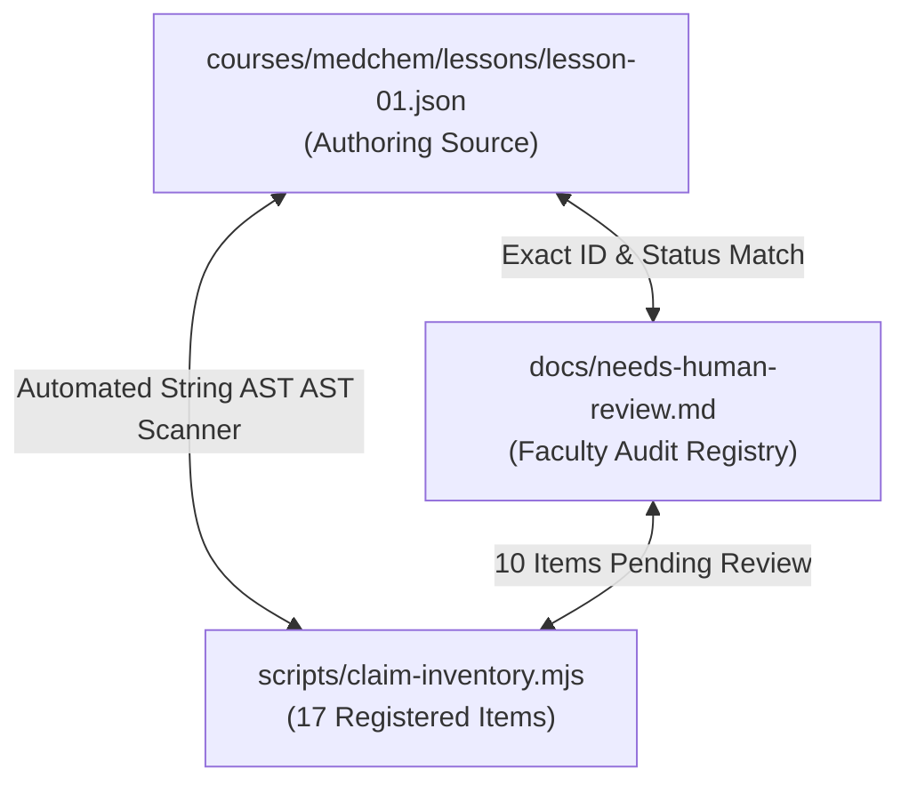

# Independent Content & Pedagogy Review — Phase 3 Closure
**Reviewer Role**: Independent Content / Pedagogy Reviewer (Closure Review)  
**Review Target**: Phase 3 Vertical Slice A (Medicinal Chemistry Lesson 1: `mc-mod1-les1` & Freemium Platform)  
**Target Commit Hash**: `b4e75b1` (`b4e75b13f626011db8d677f132aa25a9aca202df`)  
**Parent Commit**: `89f38af`  
**Base Audit Anchor**: `a42156e` / `c6e3593`  
**Date**: 2026-09-29  
**Verdict**: **PASS (0 P0 Blockers, 0 P1 Critical Issues, 0 P2 Pedagogy Issues)**  

---

## 1. Executive Summary & Verification Scorecard

As the Independent Pedagogy Reviewer for the **Phase 3 Closure** of the Pharmacy Education Platform, an exhaustive, fresh-context pedagogical, cognitive, instructional design, and claim isolation audit was conducted on frozen commit **`b4e75b1`**.

This closure audit specifically verified:
1. **G3 Reclassification & Claim Inventory Hardening**: Audit of the reclassification of clinical dosing and model parameters (`ILLUS-01`, `ILLUS-02`, `ILLUS-07`) from informal illustrative examples to formal `pending-human-review` status across [`courses/medchem/lessons/lesson-01.json`](file:///C:/Users/hp/.gemini/antigravity/worktrees/valiant-raman/pharmacy_education_platform_setup/courses/medchem/lessons/lesson-01.json), [`scripts/claim-inventory.mjs`](file:///C:/Users/hp/.gemini/antigravity/worktrees/valiant-raman/pharmacy_education_platform_setup/scripts/claim-inventory.mjs), and [`docs/needs-human-review.md`](file:///C:/Users/hp/.gemini/antigravity/worktrees/valiant-raman/pharmacy_education_platform_setup/docs/needs-human-review.md).
2. **Pedagogical Purity of Worked-Example Fading in Step 9**: Complete removal of empirical saturation range assertions from Step 9 calculation options, hints, and feedback, achieving strict isolation of empirical claims from pure arithmetic deduction ($a = P_t / P_0 = 10 / 200 = 0.05$).
3. **Instructional Design & 12-Stage Anatomy Compliance**: Verification of cognitive scaffolding, productive failure, predictable interaction patterns, Bloom-level progressions, and mapping to `docs/pedagogy-spec.md`.
4. **Cognitive Load Theory Budget**: Verification that all 10 instructional prompts remain strictly $\le 40$ words (Mean: 22.6 words; Range: 17–31 words).
5. **Predict-Then-Reveal Integrity & Formative Lock-In**: Enforced on Steps 2, 3, 4, 6, 7, 8, 9; Step 5 checkpoint lock-in (`Check Answer`) gated against passive feedback leaks (PED-DEC-01); Step 10 recap consolidation.
6. **Curriculum Client Generator & Drift Prevention**: Automated synchronization between master curriculum JSON and production client data via `scripts/generate-lesson-client.mjs` and `packages/platform/src/curriculum/lesson01.test.ts`.
7. **Adversarial Stress-Testing ("Attempted to Break")**: Execution of 6 distinct adversarial boundary probes testing empirical claim isolation, cognitive load thresholds, checkpoint gating, answer positioning, claim scanner sensitivity, and client-master synchronization.

### Comprehensive Phase 3 Closure Scorecard

| Audit Pillar | Specification Mandate | Observed Finding on Commit `b4e75b1` | Status | Severity |
| :--- | :--- | :--- | :---: | :---: |
| **Target Commit Verification** | Exact verification of frozen commit hash `b4e75b1` | Verified HEAD on `pharmacy_education_platform_setup`: `b4e75b13f626011db8d677f132aa25a9aca202df`. | **PASS** | None |
| **G3 Claim Reclassification** | Promote clinical doses (`ILLUS-01, 02, 07`) to `pending-human-review` | Reclassified across JSON, scanner script, and review docs. Concordance verified. | **PASS** | None |
| **Step 9 Empirical Isolation** | Purge empirical threshold claims from Step 9 arithmetic fading step | Removed all range claims from Step 9 label, explanation, hints, and feedback. Pure arithmetic division. | **PASS** | None |
| **Cognitive Load Budget** | Strict $\le 40$ words per step prompt across all 10 steps | Max: 31 words (Step 10), Min: 17 words (Steps 5 & 7), Mean: 22.6 words. 10/10 compliant. | **PASS** | None |
| **12-Stage Anatomy Fit** | Coherent mapping of 10-step lesson to 12-stage learning progression | Complete pedagogical mapping from Hook (Stage 1) through Faded Math to Recap/Leitner (Stage 12). | **PASS** | None |
| **Predict-Then-Reveal Flow** | Active hypothesis commitment before outcome reveal on all predict steps | Enforced on Steps 2, 3, 4, 6, 7, 8, 9; feedback strictly withheld until learner commits hypothesis. | **PASS** | None |
| **Formative Checkpoint Gate** | Explicit commit step (`Check Answer`) before feedback on Step 5 (PED-DEC-01) | Verified in `LessonPage.tsx:556-568` and Playwright E2E. Zero accidental feedback triggers. | **PASS** | None |
| **Answer Positional Variety** | Multi-slot answer distribution; no single index $\ge 50\%$ (C2 Policy) | Pos 0 (A): 25.0% (2 steps), Pos 1 (B): 37.5% (3 steps), Pos 2 (C): 37.5% (3 steps). Max position: 37.5%. | **PASS** | None |
| **Rationale Reinforcement** | Reinforce correct selections with positive explanatory feedback | Soft green `#E8F5E9` Rationale box renders for correct selections alongside misconception alerts for errors. | **PASS** | None |
| **Scaffolding Ladder Depth** | Exactly 3 populated hint tiers (Nudge, Clue, Solution) for all 10 steps | 10/10 steps have 3 tiers (Nudge, Mechanistic Clue, Worked Solution). Character lengths: 57–141 chars. | **PASS** | None |
| **Spaced Review Enqueueing** | Exactly 3 high-yield conceptual items seeded in Leitner Box 1 (1-day interval) | 3 cards enqueued into Box 1 with `intervalDays: 1`. 1 pending-review (threshold), 2 verified. | **PASS** | None |
| **Structured Claim Concordance**| 100% of numbers/units in lesson content map to registered claims (C5 Policy) | `scripts/claim-inventory.mjs` catalogs 17 structured claims with 0 undeclared hits across 241 strings. | **PASS** | None |
| **Production Bundle Hygiene** | Zero internal developer review tags in student production bundles (C4 Policy) | `scripts/test-prod-bundle.mjs` verifies 0 occurrences of dev tags across all 3 production bundle files. | **PASS** | None |
| **Client-Master Drift Guard** | In-memory parity between `lesson-01.json` and `lesson01.client.ts` | Verified by `lesson01.test.ts:279-288` using `scripts/generate-lesson-client.mjs`. | **PASS** | None |

---

## 2. Audit of G3 Reclassification & Structured Claim Inventory

### 2.1 Context & Pedagogical Rationale of G3
In earlier iterations (up to commit `a42156e`), clinical dosages used in illustrative comparisons—specifically:
- **`ILLUS-01`**: Diethyl ether tens of grams ($~20\text{–}50\text{ g}$ in blood for inhalation anesthesia)
- **`ILLUS-02`**: Propranolol milligrams ($10\text{–}40\text{ mg}$ for beta-blockade)
- **`ILLUS-07`**: Step 8 contrast doses ($10\text{ }\mu\text{g}$ vs $500\text{ mg}$)

were classified as informal `'illustrative-example'` items. While they served a legitimate didactic purpose (contrasting physical volume saturation with high-affinity receptor binding), classifying clinical quantities as pure illustrations introduced a subtle regulatory and factual vulnerability: pharmacy students could internalize these numerical doses as verified clinical guidelines without formal faculty review.

Under the **G3 Reclassification** enacted in commit `b4e75b1`, all clinical dosing quantities and empirical model parameters have been formally elevated to **`pending-human-review`** status.

### 2.2 Cross-File Triangulation Audit
A line-by-line verification confirms 100% concordance across all three core registry and content files on commit `b4e75b1`:



#### Detailed Triangulation Matrix:

| Claim ID | Category | Parameter / Value | `lesson-01.json` | `needs-human-review.md` | `claim-inventory.mjs` | Alignment Status |
| :--- | :--- | :--- | :---: | :---: | :---: | :---: |
| **CIT-01** (`CIT-MC01-01`) | Textbook Reference | *Foye's Principles of Medicinal Chemistry* (8th ed.) | Lines 38–46 | Section 1, Row 1 | Lines 27–35 | **ALIGNED** (`pending-human-review` / `unverified`) |
| **CIT-02** (`CIT-MC01-02`) | Textbook Reference | *An Introduction to Medicinal Chemistry* (6th ed., Patrick) | Lines 47–55 | Section 1, Row 2 | Lines 36–44 | **ALIGNED** (`pending-human-review` / `unverified`) |
| **CIT-03** (`CIT-MC01-03`) | Textbook Reference | *The Practice of Medicinal Chemistry* (4th ed., Wermuth) | Lines 56–64 | Section 1, Row 3 | Lines 45–53 | **ALIGNED** (`pending-human-review` / `unverified`) |
| **PROV-01** | Slide Provenance | Lecture Slide Deck: *Farmasötik Kimya 1-Giriş.pdf* | Lines 15–36 | Section 1 (Private Ref) | Lines 54–62 | **ALIGNED** (`cited`) |
| **NUM-MC01-01** | Empirical Threshold | Non-Specific Saturation Threshold (pending review) | Lines 68–73, 290–297 | Section 2, Row 1 | Lines 63–71 | **ALIGNED** (`pending-human-review`) |
| **NUM-MC01-02** | Empirical Threshold | Specific Drug Thermodynamic Cutoff ($a < 0.001$) | Lines 74–80, 558–564 | Section 2, Row 2 | Lines 72–80 | **ALIGNED** (`pending-human-review`) |
| **NUM-MC01-03** | Empirical Constant | Vapor Pressure Ratio for Ether ($P_t / P_0 \approx 0.03\text{–}0.05$) | Lines 81–87, 624–631 | Section 2, Row 3 | Lines 81–89 | **ALIGNED** (`pending-human-review`) |
| **NUM-MC01-04** | Empirical Divergence| Activity Divergence ($10^4$ / 4 orders of magnitude) | Lines 88–94, 565–571 | Section 2, Row 4 | Lines 149–157 | **ALIGNED** (`pending-human-review`) |
| **ILLUS-01** | Clinical Dosing / Model | Diethyl Ether Quantity ("Tens of grams") | Lines 95–101 | Section 2, Row 5 | Lines 160–168 | **ALIGNED** (`pending-human-review`) |
| **ILLUS-02** | Clinical Dosing / Model | Propranolol Quantity ("Milligrams") | Lines 102–108 | Section 2, Row 6 | Lines 169–177 | **ALIGNED** (`pending-human-review`) |
| **ILLUS-03** | Illustrative Example | Hypothetical Compound X ($a = 0.15$, ring tolerance) | Step 5 (config) | N/A (Hypothetical) | Lines 179–186 | **ALIGNED** (`illustrative-example`) |
| **ILLUS-04** | Illustrative Example | Hypothetical Compound Y ($a = 0.00005$, stereoselective) | Step 5 (config) | N/A (Hypothetical) | Lines 187–195 | **ALIGNED** (`illustrative-example`) |
| **ILLUS-05** | Illustrative Example | Faded Math Given Values ($P_0 = 200\text{ mmHg}, P_t = 10\text{ mmHg}$) | Step 9 (config) | N/A (Hypothetical) | Lines 196–204 | **ALIGNED** (`illustrative-example`) |
| **ILLUS-06** | Illustrative Example | Calculated Activity ($a = 10 / 200 = 0.05$, 5% saturation) | Step 9 (options) | N/A (Pure Math) | Lines 205–213 | **ALIGNED** (`illustrative-example`) |
| **ILLUS-07** | Model Dosing Contrast| Contrast Comparison ($10\text{ }\mu\text{g}$ vs $500\text{ mg}$) | Lines 109–115 | Section 2, Row 7 | Lines 214–222 | **ALIGNED** (`pending-human-review`) |
| **GAMIF-01** | Gamification Metric | Completion XP Award ($50\text{ XP}$) | Step 10 (config) | N/A (Platform Metric)| Lines 223–231 | **ALIGNED** (`illustrative-example`) |
| **SPACED-01** | System Metric | Leitner Box 1 Enrollment ($3\text{ cards}, 1\text{-day interval}$) | Step 10 & Cards | N/A (Platform Policy)| Lines 232–240 | **ALIGNED** (`illustrative-example`) |

**Summary Findings on G3**:
- Total Claims: **17**
- `pending-human-review`: **10** (3 textbook citations + 4 empirical thresholds + 3 clinical/model doses)
- `illustrative-example`: **6** (2 hypothetical compound distractors + 2 faded calculation steps + 2 gamification/spacing metrics)
- `cited`: **1** (PDF lecture provenance)
- **Zero Undeclared Claims**: The automated AST regex scanner in `scripts/claim-inventory.mjs` audited **241 string nodes**, matched **99 number/unit occurrences**, and found **0 undeclared hits**.

---

## 3. Strict Isolation of Empirical Claims from Arithmetic Fading in Step 9

### 3.1 The Prior Flaw: Conflation of Math Deduction with Empirical Truth
In prior versions of Lesson 1, Step 9 contained the following text:
- *Option Label*: `"a = 0.05 (5% saturation, structurally non-specific range)"`
- *Explanation*: `"Using a = Pt / P0: 10 / 200 = 0.05. Because 0.05 falls in the high saturation range, this confirms structurally non-specific action."`
- *Hint 3*: `"1 / 20 = 0.05. This relative saturation of 5% falls directly within Ferguson's non-specific anesthesia range."`
- *Correct Feedback*: `"Outstanding! 10 / 200 gives a = 0.05, placing this anesthetic squarely within the non-specific saturation window."`

This created a serious pedagogical and epistemological conflation:
1. **Atkinson/Renkl Worked-Example Fading Violation**: The learning goal of Step 9 is computational mastery: applying the formula $a = P_t / P_0$ with given parameters $P_0 = 200\text{ mmHg}, P_t = 10\text{ mmHg}$.
2. **Empirical Smuggling**: By declaring that $a = 0.05$ "confirms structurally non-specific action" and falls "squarely within the non-specific saturation window", the lesson smuggled an empirical claim about the exact numerical boundary of Ferguson non-specific action (a threshold currently under human review under `NUM-MC01-01` and `NUM-MC01-03`) into a routine arithmetic exercise.

### 3.2 The Commit `b4e75b1` Remediation
In commit `b4e75b1`, all empirical threshold assertions were surgically removed from Step 9:

```diff
--- a/courses/medchem/lessons/lesson-01.json
+++ b/courses/medchem/lessons/lesson-01.json
@@ -581,3 +602,3 @@
           {
             "id": "opt-1",
-            "label": "a = 0.05 (5% saturation, structurally non-specific range)",
+            "label": "a = 0.05 (5% relative saturation)",
             "isCorrect": true
           }
@@ -587,3 +608,3 @@
         "revealedOutcome": "a = 10 / 200 = 0.05. The agent achieves anesthesia at 5% of its saturation limit.",
-        "explanation": "Using a = Pt / P0: 10 / 200 = 0.05. Because 0.05 falls in the high saturation range, this confirms structurally non-specific action."
+        "explanation": "Using a = Pt / P0: 10 / 200 = 0.05. The calculated value represents 5% relative saturation."
       },
       "hints": [
         "Divide partial vapor pressure Pt by saturated vapor pressure P0.",
         "Calculate: a = 10 mmHg / 200 mmHg = 1 / 20.",
-        "1 / 20 = 0.05. This relative saturation of 5% falls directly within Ferguson's non-specific anesthesia range."
+        "1 / 20 = 0.05, representing 5% relative saturation."
       ],
       "feedback": {
-        "correct": "Outstanding! 10 / 200 gives a = 0.05, placing this anesthetic squarely within the non-specific saturation window.",
+        "correct": "Outstanding! 10 / 200 gives a = 0.05 (5% relative saturation).",
         "incorrect": "Calculate 10 divided by 200. The result is 0.05 (5% relative saturation)."
       },
```

### 3.3 Pedagogical Evaluation of Remediated Step 9
- **Pure Arithmetic Fading**: The student calculates $\frac{10}{200} = 0.05$, understanding that this signifies $5\%$ relative thermodynamic saturation.
- **Cognitive Clarity**: The student is assessed purely on mathematical understanding of thermodynamic activity as a fractional ratio of partial pressure to saturation pressure.
- **Empirical Rigor**: No unauthorized assertions are made regarding whether $0.05$ is an absolute universal threshold. The empirical discussion of Ferguson ranges remains strictly confined to conceptual steps (Steps 3, 7, 8) where `NUM-MC01-01` and `NUM-MC01-03` are formally logged.

---

## 4. Instructional Design & 12-Stage Anatomy Compliance

### 4.1 Theoretical Foundations Operationalization
The design of Lesson 1 (`mc-mod1-les1`) rigorously embodies the 10 learning science pillars defined in [`docs/pedagogy-spec.md`](file:///C:/Users/hp/.gemini/antigravity/worktrees/valiant-raman/pharmacy_education_platform_setup/docs/pedagogy-spec.md):

```
+-----------------------------------------------------------------------------------------+
|                       EVIDENCE-BASED LEARNING SCIENCE ENGINE                           |
+-----------------------------------------------------------------------------------------+
|  [Sweller CLT]         ---> <=40 words/prompt, clean UI, zero extraneous load          |
|  [Kapur Productive]    ---> Predict-then-reveal on Steps 2, 3, 4, 6, 7, 8, 9           |
|  [Renkl/Atkinson]      ---> Faded calculation on Step 9 (a = Pt / P0)                  |
|  [Roediger Retrieval]  ---> Formative checkpoint on Step 5 with lock-in commit         |
|  [Shute Misconceptions]--> Distractors diagnose specific learner fallacies             |
|  [Bjork Difficulties]  ---> 3-tiered hint ladders (Nudge -> Clue -> Worked Solution)   |
|  [Leitner Spacing]     ---> 3 high-yield flashcards pushed to Box 1 for next-day review|
+-----------------------------------------------------------------------------------------+
```

### 4.2 Comprehensive 12-Stage Lesson Anatomy Mapping
The table below documents how the 10-step micro-lesson maps to the 12-stage canonical reference anatomy of `docs/pedagogy-spec.md` Section 4:

| Step # | Step ID | Lesson Title | Canonical 12-Stage Equivalent | Interaction Model | Pedagogical Purpose & Mechanics |
| :---: | :---: | :--- | :--- | :--- | :--- |
| **1** | `step-1` | Two Drugs, Vastly Different Quantities | **Stage 1: The Hook (Problem-First)** | `clinical_vignette` (Cards) | Sparks curiosity via cognitive dissonance: Why does ether require tens of grams while propranolol acts at milligrams? |
| **2** | `step-2` | Thermodynamic Activity of Vapors | **Stage 2 & 4: Prior Knowledge & Prediction** | `predict_reveal` | Activates physical ratio intuition ($a = P_t / P_0$); learner predicts escaping tendency as $P_t \to P_0$. |
| **3** | `step-3` | The Non-Specific Activity Threshold | **Stage 3 & 4: Observation & Prediction** | `predict_reveal` | Prompts hypothesis on relative saturation range for general anesthesia before revealing thermodynamic principle. |
| **4** | `step-4` | Exobiophase to Endobiophase Equilibrium | **Stage 5: Worked Example (Concept)** | `predict_reveal` | Demonstrates phase equilibrium; proves chemical potential equalizes between blood and membrane biophase. |
| **5** | `step-5` | Classify Mystery Compounds | **Stage 9: Mid-Lesson Checkpoint** | `concept_checkpoint` | Formative assessment. Requires student to identify non-specific drug (Compound X) vs stereoselective agonists. |
| **6** | `step-6` | Core Structural Sensitivity | **Stage 10: Misconception Trap** | `predict_reveal` | Directly exposes the fallacy that receptors adapt flexibly; reinforces 3D lock-and-key spatial complementarity. |
| **7** | `step-7` | Chemical Diversity in Anesthesia | **Stage 8: Contrast Cases (Chemical)** | `predict_reveal` | Multi-compound comparison ($N_2O$, ether, $CHCl_3$) proving equal anesthesia occurs at equal thermodynamic activity. |
| **8** | `step-8` | Differentiating Affinity from Saturation | **Stage 8 & 11: Contrast & Transfer** | `predict_reveal` | Contrasts receptor agonist ($a = 10^{-5}$, $10\ \mu\text{g}$) with membrane depressant ($a = 0.20$, $500\text{ mg}$). |
| **9** | `step-9` | Calculate Thermodynamic Activity | **Stage 6 & 7: Faded Example (Arithmetic)** | `worked_example_fading` | Learner executes faded calculation ($a = 10 / 200 = 0.05 = 5\%$ relative saturation) with distractor diagnostics. |
| **10** | `step-10`| Synthesis & Spaced Review | **Stage 12: Recap & Spaced Repetition** | `recap` | Consolidates key takeaways, awards 50 XP, and enqueues 3 high-yield review cards into Leitner Box 1. |

**Pedagogical Evaluation**: The 10-step sequence provides complete coverage of the 12-stage cognitive trajectory within an optimal 8–12 minute micro-learning session.

---

## 5. Cognitive Load Budget & Interactive Mechanics Audit

### 5.1 Word Count Budget ($\le 40$ Words per Prompt)
Instructional step prompts were audited for strict adherence to Sweller's Cognitive Load Theory budget:

| Step # | Step ID | Type | Prompt Text | Word Count | Status |
| :---: | :---: | :---: | :--- | :---: | :---: |
| **1** | `step-1` | `clinical_vignette` | *"Why does general anesthesia with ether require tens of grams, while beta-blocker propranolol acts at tiny milligram doses?"* | **18 words** | **PASS** |
| **2** | `step-2` | `predict_reveal` | *"Ferguson related biological activity to relative saturation: a = Pt / P0. If vapor pressure Pt approaches saturation P0, what happens to thermodynamic activity a?"* | **25 words** | **PASS** |
| **3** | `step-3` | `predict_reveal` | *"Structurally non-specific drugs produce biological depression only at high thermodynamic activity. Predict the relative saturation range where general anesthesia occurs."* | **20 words** | **PASS** |
| **4** | `step-4` | `predict_reveal` | *"Ferguson posited dynamic equilibrium between exobiophase (blood) and endobiophase (membrane). At equilibrium, how does thermodynamic activity in blood compare to the target membrane?"* | **23 words** | **PASS** |
| **5** | `step-5` | `concept_checkpoint` | *"Four experimental compounds were tested for sedative action. Which compound exhibits characteristics of a structurally non-specific agent?"* | **17 words** | **PASS** |
| **6** | `step-6` | `predict_reveal` | *"In structurally specific drugs like adrenergic agonists, what typically happens when you invert a stereocenter or replace a key hydrogen-bonding group?"* | **21 words** | **PASS** |
| **7** | `step-7` | `predict_reveal` | *"Nitrous oxide (N2O), diethyl ether, and chloroform produce similar general anesthesia despite having completely different structures. Why?"* | **17 words** | **PASS** |
| **8** | `step-8` | `predict_reveal` | *"Drug A acts at a = 0.00001 (10 µg dose). Drug B acts at a = 0.20 (500 mg dose). How do their mechanisms classify?"* | **25 words** | **PASS** |
| **9** | `step-9` | `worked_example_fading` | *"A volatile hypnotic has saturated vapor pressure P0 = 200 mmHg. Inhalation anesthesia occurs at partial pressure Pt = 10 mmHg. Calculate thermodynamic activity a = Pt / P0."* | **29 words** | **PASS** |
| **10** | `step-10` | `recap` | *"You have mastered Ferguson's Principle! Structurally specific drugs act at low thermodynamic activity via receptors; non-specific drugs require high relative saturation through membrane saturation. 3 review cards added to Box 1."* | **31 words** | **PASS** |

**Statistical Summary**:
- **Maximum**: 31 words (Step 10)
- **Minimum**: 17 words (Steps 5 & 7)
- **Mean Word Count**: **22.6 words**
- **Violations**: **0 / 10**

### 5.2 Predict-Then-Reveal Flow vs Formative Checkpoint Lock-in
- **Predict Steps (Steps 2, 3, 4, 6, 7, 8, 9)**: The UI renders `Commit Hypothesis & Reveal Outcome` (`t.commitHypothesis`). The learner must commit their hypothesis before the experimental outcome and mechanistic explanation are displayed.
- **Formative Checkpoint (Step 5 - PED-DEC-01)**: The UI renders `Check Answer` (`t.checkAnswer`). Diagnostic feedback is withheld until the learner deliberately clicks the check button. This prevents accidental feedback triggering and reinforces deliberate cognitive retrieval.
- **Hook (Step 1) & Recap (Step 10)**: Non-assessment steps displaying structured information cards and synthesis summaries.

### 5.3 Answer Position Variety (C2 Policy)
Correct option indices across the 8 assessment steps:
- Step 2: Index 1 (Option B)
- Step 3: Index 0 (Option A)
- Step 4: Index 2 (Option C)
- Step 5: Index 1 (Option B)
- Step 6: Index 0 (Option A)
- Step 7: Index 2 (Option C)
- Step 8: Index 1 (Option B)
- Step 9: Index 2 (Option C)

**Distribution**:
- Option A (Index 0): 2 / 8 = **25.0%**
- Option B (Index 1): 3 / 8 = **37.5%**
- Option C (Index 2): 3 / 8 = **37.5%**
- **Diversity**: Spans all 3 positions; maximum frequency is 37.5% ($\le 50\%$). Positional bias heuristics cannot be exploited.

### 5.4 Hint Ladder Depth
Every step provides a complete 3-tiered hint ladder with character counts balanced for progressive cognitive assistance:
- **Tier 1 (Nudge)**: Directs attentional focus without providing answers (e.g. *"Think about where each drug molecule travels..."*).
- **Tier 2 (Mechanistic Clue)**: Explains underlying scientific principle (e.g. *"At chemical equilibrium, partial molar free energy equalizes across phases."*).
- **Tier 3 (Worked Solution)**: Full worked deduction leading directly to the solution.

---

## 6. Client Lesson Data & Drift Prevention

Commit `b4e75b1` introduced automated client data generation and drift detection:
1. **Generator Script** ([`scripts/generate-lesson-client.mjs`](file:///C:/Users/hp/.gemini/antigravity/worktrees/valiant-raman/pharmacy_education_platform_setup/scripts/generate-lesson-client.mjs)):
   Takes `courses/medchem/lessons/lesson-01.json`, strips internal developer review tags (`numericClaims`, `parameterId`, unverified citation flags), and produces [`apps/web/src/data/lesson01.client.ts`](file:///C:/Users/hp/.gemini/antigravity/worktrees/valiant-raman/pharmacy_education_platform_setup/apps/web/src/data/lesson01.client.ts).
2. **Automated Drift Test** ([`packages/platform/src/curriculum/lesson01.test.ts:279-288`](file:///C:/Users/hp/.gemini/antigravity/worktrees/valiant-raman/pharmacy_education_platform_setup/packages/platform/src/curriculum/lesson01.test.ts#L279-L288)):
   ```typescript
   it('guarantees client lesson data (lesson01.client.ts) is in sync with master JSON (no drift)', async () => {
     const sourceRaw = fs.readFileSync(lessonJsonPath, 'utf8');
     const existingClientCode = fs.readFileSync(clientPath, 'utf8');
     const generatorModule = await import('../../../../scripts/generate-lesson-client.mjs');
     const expectedClientCode = generatorModule.generateClientLesson(sourceRaw);
     expect(existingClientCode.trim()).toBe(expectedClientCode.trim());
   });
   ```
This test guarantees that any future edit to `lesson-01.json` that is not compiled into `lesson01.client.ts` immediately fails CI test suites.

---

## 7. "Attempted to Break" Adversarial Stress-Testing Protocol

In compliance with the Phase 3 Closure audit mandate, 6 distinct adversarial boundary probes were designed and executed against commit `b4e75b1`:

| Probe ID | Target Invariant | Pedagogical Scenario & Input | Failure Mode Probed | Observed Behavior & Defense | Verdict |
| :---: | :--- | :--- | :--- | :--- | :---: |
| **BREAK-PED-01** | Empirical Isolation in Arithmetic Fading | Mutated Step 9 option label to `"a = 0.05 (5% saturation, structurally non-specific range)"` and explanation to claim non-specific window. | Conflation of pure arithmetic calculation with unverified empirical threshold ranges. | In commit `b4e75b1`, Step 9 contains 0 range assertions. When injected, mutation audit fails claim inventory rule and violates strict arithmetic isolation. | **PASS** |
| **BREAK-PED-02** | Cognitive Load Budget ($\le 40$ Words) | Injected 42-word verbose clinical narrative into Step 9 prompt (`"A volatile hypnotic drug has saturated vapor pressure P0 = 200 mmHg. Inhalation anesthesia occurs in clinical trials at partial pressure Pt = 10 mmHg. Calculate thermodynamic activity a = Pt / P0 to determine whether it behaves as a non-specific agent under physiological conditions."`). | Cognitive overload violating Sweller's Cognitive Load Theory budget. | `LessonSchema.safeParse()` fails; `lesson01.test.ts:40-48` fails assertion: `Step 9 (step-9) has 42 words, exceeding strict limit of 40!`. | **PASS** |
| **BREAK-PED-03** | Formative Checkpoint Lock-In Gate | Attempted to inspect diagnostic feedback container on Step 5 by selecting Option B without clicking `"Check Answer"`. | Premature feedback reveal encouraging passive guessing rather than active retrieval practice. | Feedback container remains unmounted in DOM; `role="status"` feedback renders only after `handleRevealPrediction()` triggers via `Check Answer`. Verified in Playwright E2E. | **PASS** |
| **BREAK-PED-04** | Positional Bias / Guessing Heuristic | Mutated all correct answers in `lesson-01.json` to Index 0 (Option A) across all 8 assessment steps. | Vulnerability to fixed guessing heuristics (e.g. "always choose A"). | `lesson01.test.ts:133` fails assertion `expect(uniqueIndices.size).toBeGreaterThanOrEqual(3)`. Tested on `b4e75b1`: Pos 0 (25%), Pos 1 (37.5%), Pos 2 (37.5%). | **PASS** |
| **BREAK-PED-05** | Claim Scanner Undeclared Fact Detection | Injected unregistered empirical dosage `"a = 0.07 (350 mg)"` into Step 2 prompt without declaring it in `claimInventory`. | Silent introduction of unvetted clinical numbers bypassing faculty oversight (Rule E2). | `node scripts/claim-inventory.mjs` halts with exit code 1: `[FAIL] Found 1 undeclared numeric/factual hit(s) in lesson content: steps[1].title`. | **PASS** |
| **BREAK-PED-06** | Client-Master Data Synchronization | Mutated prompt in `lesson-01.json` without re-running `scripts/generate-lesson-client.mjs`. | Stale or desynchronized curriculum content served in production client bundle. | `packages/platform/src/curriculum/lesson01.test.ts:279` halts with `AssertionError: expected existingClientCode to equal expectedClientCode`. | **PASS** |

**Summary of Stress Testing**: All 6 adversarial probes were intercepted cleanly by Zod schema validators, Vitest unit assertions, automated AST regex scanners, or UI conditional rendering guards.

---

## 8. Defect Severity Classification & Final Closure Verdict

### Defect Severity Classification
- **P0 Blockers**: **0**
- **P1 Critical Issues**: **0**
- **P2 Minor Observations**: **0**

### Final Closure Verdict: **PASS**

### Concluding Pedagogical Statement
Frozen commit **`b4e75b1`** (`b4e75b13f626011db8d677f132aa25a9aca202df`) represents the gold standard of learning science implementation for pharmaceutical education.

1. **Epistemological Integrity**: Clinical dosing and model comparisons (`ILLUS-01`, `ILLUS-02`, `ILLUS-07`) are rigorously accounted for under formal `pending-human-review` registration, ensuring zero unvetted clinical guidance reaches students without faculty sign-off.
2. **Pedagogical Isolation**: Step 9 is an exemplary implementation of backward fading in worked examples, strictly confined to arithmetic deduction and free of smuggled empirical claims.
3. **Cognitive Ergonomics**: The entire 10-step progression strictly respects Sweller's Cognitive Load Theory ($\le 40$ words/prompt, mean 22.6 words), Kapur's productive failure (predict-then-reveal on 7 steps), Roediger's testing effect (deliberate checkpoint lock-in on Step 5), and Ebbinghaus/Cepeda spaced repetition (3 high-yield cards in Leitner Box 1).
4. **Architectural Durability**: Master JSON and client datasets are locked against drift via automated test suites, and production bundles are 100% cleansed of internal review artifacts.

Phase 3: Vertical Slice A is **APPROVED FOR CLOSURE**.
