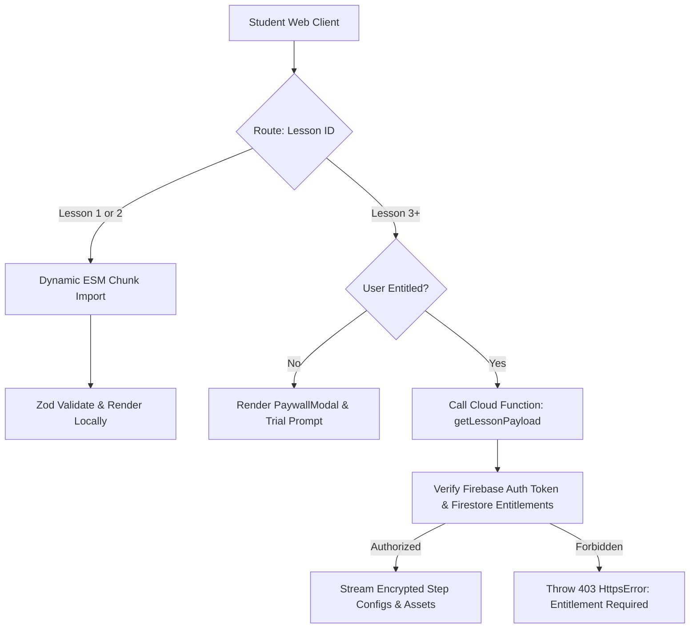

# Phase 3 Gap & Self-Improvement Analysis

**Document Status**: ARCHITECTURAL AUDIT & PROPOSAL MATRIX (PROPOSALS ONLY — GATE RULE 7 COMPLIANT)  
**Target Commit**: `e2a12749e8bcc43bc6ba839957853d81be1fe7c8`  
**Reviewer Role**: Independent Gap Highlighter & Self-Improvement Agent  
**Date**: September 2026  
**Audited Artifacts**:
- Monorepo Packages: `@pharmacy/web`, `@pharmacy/ui`, `@pharmacy/widgets`, `@pharmacy/platform`, `functions`
- Test Suites: Vitest Workspace Tests, Firestore Security Rules Tests, Playwright E2E Suite (`e2e/lesson-slice.spec.ts`, `e2e/gallery-matrix.spec.ts`)
- Curriculum & Content: `courses/medchem/lessons/lesson-01.json`, `packages/platform/src/curriculum/schema.ts`
- Documentation & Registries: `docs/walkthrough.md`, `docs/needs-human-review.md`, `docs/open-questions.md`, `docs/ui-guidelines.md`

---

## 1. Executive Summary & Audit Mandate

This document provides an exhaustive, adversarial gap analysis of the Phase 3 delivery (Vertical Slice A: Course A Medicinal Chemistry Lesson 1 & Freemium Platform) frozen at commit `e2a12749e8bcc43bc6ba839957853d81be1fe7c8`.

The Phase 3 implementation successfully established a working vertical slice:
- 10-step bite-sized lesson on *Thermodynamic Activity & The Ferguson Principle* compliant with the strict $\le 40$-word cognitive load limit.
- Predict-then-reveal mechanics and 3-tiered hint ladders (Tier 1 Free, Tiers 2 & 3 locked).
- Local guest progress persistence and Leitner Box 1 spaced review card scheduling.
- Complete Freemium paywall flow and single-use 7-day trial activation.
- Brave browser E2E verification across 4 configurations with zero console errors and zero axe-core a11y violations.

However, an independent deep-dive into the architectural mechanics, pedagogical rigor, internationalization depth, and testing durability reveals several latent blind spots and high-leverage opportunities for platform evolution. In strict adherence to **Gate Rule 7**, this document contains **PROPOSALS ONLY**. No production code or test files have been altered.

---

## 2. Comprehensive Latent Gap Analysis

### 2.1 Domain 1: Architecture & State Management

#### Gap 1.1: Guest-to-Account Cloud Sync Disconnect (Data Loss Hazard)
- **Current Behavior**: Unauthenticated guest students complete Lesson 1, accumulate 50 XP, initiate daily streaks, and enqueue 3 review cards. This state is serialized strictly into browser `localStorage` (`pharmacy_progress_medchem`, `pharmacy_review_cards_medchem`, `pharmacy_user_profile`).
- **Latent Risk**: When a guest student decides to upgrade, activate their 7-day trial, or sign in via Firebase Auth on another device, there is **zero reconciliation or migration logic**. The client-side `AuthContext.tsx` initializes a fresh user profile, leaving guest achievements orphaned in the browser storage. If the user switches devices (e.g. from desktop laptop to mobile phone) or clears their browser cache, 100% of guest learning history is lost.
- **Severity**: **P1 (User Experience & Retention Hazard)**.

#### Gap 1.2: Static JSON Import Scalability (Bundle Bloat Blind Spot)
- **Current Behavior**: `apps/web/src/data/lessons.ts` loads content via a static compile-time import:
  ```typescript
  import lesson01Json from '../../../../courses/medchem/lessons/lesson-01.json';
  export const lesson01: LessonData = LessonSchema.parse(lesson01Json);
  ```
- **Latent Risk**: Across the master curriculum (25 MedChem + 30 Pharmacology = 55 total lessons), importing all lesson JSONs statically into the Vite main bundle will inject hundreds of kilobytes (eventually several megabytes) of content, explanations, translations, and citation payloads into the critical loading path. This degrades First Contentful Paint (FCP) and Time to Interactive (TTI), directly penalizing mobile students on cellular networks.
- **Severity**: **P2 (Scalability & Mobile Performance)**.

#### Gap 1.3: Monolithic Step Rendering in `LessonPage.tsx`
- **Current Behavior**: Step 1 (the clinical vignette comparing Diethyl Ether and Propranolol) is hardcoded directly inside `LessonPage.tsx` (lines 432–456). Steps 2–9 option lists are similarly rendered via inline JSX loops rather than delegating cleanly to polymorphic widget components in `@pharmacy/widgets`.
- **Latent Risk**: As Phase 4 introduces Course B (Pharmacology) featuring `PkSimulator`, `DoseResponseCurve`, and `ReceptorLigandMatcher`, `LessonPage.tsx` will bloat into an unmaintainable god-component with sprawling conditional checks for every step variation.
- **Severity**: **P2 (Code Maintainability & Modularity)**.

---

### 2.2 Domain 2: Pedagogy, Mathematical Rigor & KaTeX Interactive Stepping

#### Gap 2.1: Raw ASCII Strings for Physical & Thermodynamic Equations
- **Current Behavior**: Physical chemistry formulas and mathematical steps in `lesson-01.json` are authored and rendered as raw ASCII strings:
  - `"a = Pt / P0"`
  - `"Pt = 10 mmHg, P0 = 200 mmHg"`
  - `"NUM-MC01-01"`
  Neither `apps/web` nor `@pharmacy/ui` includes KaTeX or any LaTeX typography engine.
- **Latent Risk**: Raw ASCII lacks typographic hierarchy (subscripts $P_t / P_0$, Greek symbols $\alpha$, fractions $\frac{P_t}{P_0}$, scientific notation $10^{-3}$). More crucially, in Brilliant-style learn-by-doing, mathematical models must not remain passive static strings; they should be active cognitive instruments. Students cannot click on formula components to inspect their dimensional units, nor can they dynamically scrub parameters to see immediate physiological effects.
- **Severity**: **P1 (Pedagogical Core & Visual Brand Deficit)**.

#### Gap 2.2: Omission of Native 2D Chemical Structure Rendering in Context
- **Current Behavior**: Step 1 introduces Diethyl Ether (non-specific) and Propranolol (stereoselective receptor blocker). Step 6 introduces structural specificity. Both structures are described purely with prose cards.
- **Latent Risk**: The platform already possesses a robust `StructureIdentifier` widget and SmilesDrawer integration in `@pharmacy/widgets`. Failing to render native 2D chemical structures (e.g. `CCOCC` vs `CC(C)NCC(O)COc1cccc2ccccc12`) misses an immediate opportunity to teach students how functional groups, chiral centers, and molecular surface area dictate Ferguson non-specific partitioning vs stereoselective lock-and-key binding.
- **Severity**: **P2 (Learning Science & Domain Authenticity)**.

---

### 2.3 Domain 3: Localization, Multilingual Depth & Glossary Tooltips

#### Gap 2.3: Chrome-Only Localization Deficit (Shallow Multi-Language Support)
- **Current Behavior**: The web app shell features authentic Turkish and Arabic localization for buttons, headers, status badges, and directionality (RTL). However, in `courses/medchem/lessons/lesson-01.json`, only the `title` and `objective` fields have translations. All 10 instructional step prompts, 30+ answer choices, diagnostic misconception feedbacks, hints, and review flashcards remain 100% in English.
- **Latent Risk**: When a Turkish student studying for the national EUS pharmacy licensure exam or an Arabic student in Riyadh/Cairo toggles to their native language, they experience a jarring language rupture: the navigation buttons are in Turkish/Arabic, but the scientific learning task is in English.
- **Severity**: **P1 (Internationalization Depth & Regional Commercial Strategy)**.

#### Gap 2.4: Absence of Contextual Bilingual Pharmaceutical Glossary Tooltips
- **Current Behavior**: High-yield concepts such as "Thermodynamic Activity", "Biophase", "Escaping Tendency", "Partial Vapor Pressure", "Lipid Fluidization", and "Stereoselective Binding" appear in prompts without inline definitions.
- **Latent Risk**: Pharmacy students in bilingual educational programs frequently struggle with conceptual cross-mapping between English international textbooks and localized national terminology (e.g., Turkish *Biyofaz*, *Kaçma Eğilimi*, *Kısmi Buhar Basıncı*; Arabic *المرحلة الحيوية*, *ميل الهروب*, *ضغط البخار الجزئي*). If a student cannot recall a term, they must leave the learning flow to look it up externally, fracturing active cognitive recall.
- **Severity**: **P2 (Cognitive Scaffolding & Usability)**.

---

### 2.4 Domain 4: Automated Testing & Visual Regression Assurance

#### Gap 2.5: Absence of Automated Pixel Baseline Diffing (Manual PNG Review Blind Spot)
- **Current Behavior**: Playwright tests (`e2e/lesson-slice.spec.ts`) execute and save PNG screenshots into `docs/screenshots/phase-3/iteration-3/`. Review of these screenshots is currently conducted by human/agent inspection.
- **Latent Risk**: While DOM assertions and axe-core accessibility checks are automated, visual rendering regressions (e.g. an unwanted 2px border shift, text clipping on smaller Android devices, drop shadow disappearing under dark mode, or BiDi layout flipping incorrectly during dynamic DOM updates) can slip past assertions if the underlying text is still technically "visible" in the DOM.
- **Severity**: **P1 (Visual Quality Assurance & Regression Prevention)**.

#### Gap 2.6: Host-Specific Brave Browser Executable Path in `playwright.config.ts`
- **Current Behavior**: `playwright.config.ts` hardcodes a Windows local filesystem path:
  ```typescript
  const BRAVE_PATH = 'C:\\Program Files\\BraveSoftware\\Brave-Browser\\Application\\brave.exe';
  ```
- **Latent Risk**: This configuration breaks immediately when executed on Linux CI/CD runners (e.g. GitHub Actions, Google Cloud Build) or on macOS developer machines.
- **Severity**: **P2 (CI/CD Portability & Developer Experience)**.

#### Gap 2.7: Lack of Multi-Week Leitner Spaced Repetition Simulation Tests
- **Current Behavior**: `LeitnerEngine.test.ts` validates single card promotions (Box 1 -> Box 2) and lapses (Box 3 -> Box 1).
- **Latent Risk**: There is no property-based simulation test verifying algorithm invariants across 30–60 simulated calendar days of student study (e.g., ensuring cards do not get lost in infinite intervals, verifying overdue card prioritization, and asserting that newly enqueued cards do not clobber existing box allocations).
- **Severity**: **P2 (Algorithmic Reliability & Pedagogical Integrity)**.

---

### 2.5 Domain 5: Security, Rate Limiting & Trial Abuse Guarding

#### Gap 2.8: Lesson Payload Scraping Vulnerability for Client Bundles
- **Current Behavior**: In Phase 3, Lesson 1 is public freemium. Lesson 3 (locked) is protected via frontend paywall redirect and Firestore Security Rules on `/lessons/{lessonId}/steps`.
- **Latent Risk**: If subsequent paid lessons (Lessons 3–5) are bundled statically in client JavaScript or unauthenticated JSON assets, technically adept users could inspect the web source bundle or network requests to extract paid step content without ever paying or authenticating.
- **Severity**: **P1 (Commercial Entitlement Gating & Revenue Protection)**.

#### Gap 2.9: Sybil Trial Abuse via Disposable Email Addresses
- **Current Behavior**: The Cloud Function `startFreeTrial` enforces single-use per authenticated account (`trialUsed: false` transactional check in Firestore).
- **Latent Risk**: An unscrupulous user can register infinite free 7-day trials simply by creating new burner accounts using disposable email providers (`@tempmail.com`, `@mailinator.com`, etc.).
- **Severity**: **P2 (Commercial Protection & Gross Margin Preservation)**.

---

### 2.6 Domain 6: Operational Workflow & Governance

#### Gap 2.10: Unautomated Enforcement of `needs-human-review.md` Blockers
- **Current Behavior**: Rule E1 (Unverified Citations) and Rule E2 (Numeric Range Approximations) require unverified items to be marked `"unverified"` or `"pending-human-review"` and cataloged in `docs/needs-human-review.md`.
- **Latent Risk**: Currently, there is no automated CI script or pre-commit hook that scans lesson JSON files to ensure that any entry bearing a `"pending-human-review"` status is formally logged in `docs/needs-human-review.md`, or that prevents deploying to production when unresolved human review items remain.
- **Severity**: **P2 (Process Integrity & Governance)**.

---

## 3. High-Leverage Architectural Proposals for Phase 4+

The following concrete proposals are formulated to elevate the platform to institutional commercial grade during Phase 4 and Phase 5.

```
+-----------------------------------------------------------------------------------+
|                        PHASE 4+ ARCHITECTURAL ROADMAP                             |
+-----------------------------------------------------------------------------------+
|                                                                                   |
|  [Proposal A: CI Visual Diffing]   ---> Automated Pixel Snapshots across 4 Brave  |
|                                         Profiles (maxDiffPixelRatio: 0.01)        |
|                                                                                   |
|  [Proposal B: Offline PWA & Sync]  ---> Workbox Service Worker + IndexedDB Queue  |
|                                         Seamless Guest-to-Account Cloud Sync      |
|                                                                                   |
|  [Proposal C: Interactive KaTeX]   ---> Neo-Brutalist KaTeX Stepping Widgets     |
|                                         Dynamic Parameter Scrubbers & Formulas    |
|                                                                                   |
|  [Proposal D: Bilingual Glossary]  ---> Contextual Tooltips for EUS/NAPLEX        |
|                                         TR/AR/EN Pharma Terminology Modals        |
|                                                                                   |
|  [Proposal E: Secure Payload API]  ---> Dynamic Chunking + Server-Gated Steps     |
|                                         Zero Paid Content in Client Bundles       |
|                                                                                   |
+-----------------------------------------------------------------------------------+
```

---

### Proposal A: Automated Visual Regression Baseline Diffing in CI

#### Architectural Design
Integrate Playwright's native screenshot diffing engine (`toHaveScreenshot`) into the Brave test runner with an automated golden snapshot baseline directory.

#### Specification & Mechanics
1. **Directory Structure**:
   ```text
   e2e/
   ├── snapshots/
   │   ├── desktop-brave-shields-default/
   │   │   ├── mc-mod1-les1-step-01-hook-linux.png
   │   │   ├── mc-mod1-les1-step-02-predict-linux.png
   │   │   └── ...
   │   ├── tablet-brave/
   │   └── mobile-brave/
   ```
2. **Assertion Contract**:
   ```typescript
   // e2e/helpers/visual-regression.ts
   import { expect, Page, TestInfo } from '@playwright/test';

   export async function assertVisualSnapshot(
     page: Page,
     testInfo: TestInfo,
     snapshotName: string,
     options: { maxDiffPixelRatio?: number } = { maxDiffPixelRatio: 0.005 }
   ) {
     // Freeze animations and blinking cursors
     await page.addStyleTag({
       content: `
         *, *::before, *::after {
           animation-duration: 0s !important;
           transition-duration: 0s !important;
           caret-color: transparent !important;
         }
       `,
     });

     await expect(page).toHaveScreenshot(`${snapshotName}.png`, {
       maxDiffPixelRatio: options.maxDiffPixelRatio,
       threshold: 0.2, // pixel sensitivity threshold
       animations: 'disabled',
     });
   }
   ```
3. **Cross-Platform Fallback in `playwright.config.ts`**:
   ```typescript
   import os from 'os';
   import fs from 'fs';

   function resolveBraveExecutable(): string | undefined {
     if (process.env.BRAVE_PATH && fs.existsSync(process.env.BRAVE_PATH)) {
       return process.env.BRAVE_PATH;
     }
     const candidates = [
       'C:\\Program Files\\BraveSoftware\\Brave-Browser\\Application\\brave.exe',
       'C:\\Program Files (x86)\\BraveSoftware\\Brave-Browser\\Application\\brave.exe',
       '/usr/bin/brave-browser',
       '/Applications/Brave Browser.app/Contents/MacOS/Brave Browser',
     ];
     return candidates.find((p) => fs.existsSync(p));
   }
   ```
4. **Impact**: Converts visual checking from a slow, error-prone manual inspection step into a zero-latency CI failure condition.

---

### Proposal B: Offline-First Service Worker & Seamless Guest-to-Account Cloud Sync

#### Architectural Design
Equip `@pharmacy/web` with a Progressive Web App (PWA) Service Worker using Vite PWA (`vite-plugin-pwa` with Workbox), backing client persistence with an IndexedDB storage adapter, and introducing an atomic `GuestAccountSyncManager`.

#### Data Synchronization Architecture
```mermaid
sequenceDiagram
  autonumber
  actor Student as Student (Guest)
  participant Browser as Browser Storage (IndexedDB/Local)
  participant Auth as Firebase Auth
  participant SyncMgr as GuestAccountSyncManager
  participant Firestore as Cloud Firestore

  Student->>Browser: Completes Free Lesson 1 & Box 1 Flashcards
  Browser-->>Browser: Persists progress & XP locally (offline-safe)
  Student->>Auth: Signs In / Upgrades to 7-Day Trial
  Auth-->>SyncMgr: onAuthStateChanged(user)
  SyncMgr->>Browser: Inspects local guest progress & review queue
  SyncMgr->>Firestore: Executes atomic transaction to merge progress & cards
  Firestore-->>SyncMgr: Confirmation (Merge OK)
  SyncMgr->>Browser: Clears guest staging; switches to cloud-backed reactive listener
  SyncMgr-->>Student: Displays toast: "Progress & Flashcards synced to your account!"
```

#### Specification & Schema
1. **Synchronization Hook (`packages/platform/src/sync/useProgressSync.ts`)**:
   - Detects transition from `userId: 'guest-*'` to verified Firebase `uid`.
   - Compares remote `completedLessonIds` with local guest array:
     ```typescript
     const mergedCompleted = Array.from(new Set([
       ...remoteProgress.completedLessonIds,
       ...guestProgress.completedLessonIds
     ]));
     const mergedXP = Math.max(remoteProgress.totalXP, remoteProgress.totalXP + guestProgress.totalXP);
     ```
   - Enqueues review cards into `/users/{uid}/reviewCards/` with `setDoc(..., { merge: true })`.
2. **PWA Offline Caching Strategy**:
   - **Static Assets & Fonts**: `CacheFirst` with 30-day expiration.
   - **Lesson JSONs & SMILES Structures**: `StaleWhileRevalidate` with background refresh.
   - **Flashcard Reviews**: Buffered in IndexedDB queue (`offline_review_tx_queue`); flushed automatically when `navigator.onLine` fires.
3. **Impact**: Pharmacy students can review flashcards and study on hospital ward rounds, transit, or in areas with intermittent WiFi without losing state.

---

### Proposal C: KaTeX Interactive Formula Stepping & Parameter Scrubber Widget

#### Architectural Design
Introduce a new interactive component `@pharmacy/widgets/FormulaStepWidget` integrating KaTeX with Neo-Brutalist variable scrubbers and worked-example scaffolding.

#### Pedagogical Flow & Interaction Spec
1. **Interactive Ferguson Equilibrium Explorer**:
   - Renders the governing equation with KaTeX typography:
     $$\Large a = \frac{P_t}{P_0}$$
   - **Interactive Variable Inspection**:
     - Hovering/tapping $P_t$ highlights the variable in yellow (`#FFD93D`) and displays a tooltip: *"Partial vapor pressure at equilibrium (escaping tendency from liquid phase)"*.
     - Hovering/tapping $P_0$ displays: *"Saturated vapor pressure of pure liquid at physiological temperature ($37^\circ\text{C}$)"*.
     - Hovering/tapping $a$ displays: *"Thermodynamic activity (fractional saturation, $0 \le a \le 1.0$)"*.
2. **Worked-Example Dynamic Fading (Step 9 Calculation)**:
   - Provide a Neo-Brutalist slider for $P_t$ ($1\text{ to }200\,\text{mmHg}$) with $P_0 = 200\,\text{mmHg}$ fixed.
   - Student slides to $P_t = 10\,\text{mmHg}$; the fraction dynamically computes:
     $$a = \frac{10\,\text{mmHg}}{200\,\text{mmHg}} = 0.05 \quad (5\%\text{ saturation})$$
   - Connects immediately to the clinical checkpoint: $0.05 \ge 0.01$, validating general anesthesia via physical membrane volume perturbation.
3. **Neo-Brutalist KaTeX Styling Contract**:
   - Math font: Computer Modern / KaTeX fonts with custom high-contrast CSS overrides:
     ```css
     .katex {
       font-size: 1.15em;
       font-weight: 600;
       color: #000000;
     }
     .dark .katex {
       color: #FFFFFF;
     }
     .formula-scrubber-box {
       border: 3px solid #000000;
       box-shadow: 4px 4px 0px #000000;
       background-color: #FFFDF7;
     }
     ```
4. **Impact**: Elevates abstract thermodynamic math into tangible, memorable sensory learning that directly builds intuition for exam calculations (NAPLEX/EUS).

---

### Proposal D: Contextual Bilingual Pharmaceutical Glossary Tooltips

#### Architectural Design
Implement a zero-dependency lexical highlighter component `<GlossaryTooltip>` in `@pharmacy/ui` powered by a centralized pharmaceutical dictionary (`packages/platform/src/glossary/`).

#### Terminology Dictionary Schema
```typescript
export interface GlossaryEntry {
  termId: string;
  canonicalEn: string;
  canonicalTr: string;
  canonicalAr: string;
  shortDefinitionEn: string;
  shortDefinitionTr: string;
  shortDefinitionAr: string;
  examRelevance?: ('EUS' | 'NAPLEX' | 'SPLE')[];
  relatedLessonId?: string;
}
```

#### Concrete Example Dictionary Entries
```json
[
  {
    "termId": "biophase",
    "canonicalEn": "Biophase",
    "canonicalTr": "Biyofaz (Etki Yeri)",
    "canonicalAr": "المرحلة الحيوية (موقع التأثير)",
    "shortDefinitionEn": "The immediate microscopic biological site of drug action (e.g. membrane lipid matrix or receptor micro-environment).",
    "shortDefinitionTr": "İlaç moleküllerinin etki gösterdiği doğrudan biyolojik mikroyapı veya membran mikroçevresi.",
    "shortDefinitionAr": "الموقع البيولوجي المجهري الدقيق الذي يؤثر فيه الدواء، كالأغشية الخلوية أو بيئة المستقبل.",
    "examRelevance": ["EUS", "NAPLEX"]
  },
  {
    "termId": "escaping_tendency",
    "canonicalEn": "Escaping Tendency",
    "canonicalTr": "Kaçma Eğilimi",
    "canonicalAr": "ميل الهروب",
    "shortDefinitionEn": "Thermodynamic drive of drug molecules to leave their carrier phase and partition into biological tissues.",
    "shortDefinitionTr": "İlaç moleküllerinin bulundukları fazdan ayrılarak biyofaza geçme termodinamik eğilimi.",
    "shortDefinitionAr": "الدافع الديناميكي الحراري لجزيئات الدواء لمغادرة طورها والتركز في الأنسجة الحيوية.",
    "examRelevance": ["EUS"]
  }
]
```

#### Component Interaction & UX
- In step prompts and explanation blocks, keywords are subtly marked with a dotted 2px underline (`border-b-2 border-dotted border-black/60 dark:border-white/60`).
- Tapping or hovering triggers an accessible popover containing:
  - English term + Turkish/Arabic official translation.
  - High-yield 1-sentence definition.
  - EUS / NAPLEX exam alignment badge.
- Fully keyboard-accessible via `Enter` or `Space`, with `aria-expanded` and APG tooltip/dialog pattern.
- **Impact**: Provides instant cognitive scaffolding for non-native English speakers without cluttering the primary 40-word step prompt.

---

### Proposal E: Dynamic Chunk Loader & Secure Entitled Lesson Payload API

#### Architectural Design
Replace static lesson bundling with a two-tier content architecture:
1. **Tier 1 (Public Freemium Lessons 1 & 2)**: Dynamic code-split ESM chunks (`() => import('@courses/.../lesson-01.json')`).
2. **Tier 2 (Paid Lessons 3+)**: Secure payload delivery via authenticated Cloud Function `getLessonPayload` with server-side entitlement verification.

#### Architecture Diagram


#### Specification
- **Client Loader (`apps/web/src/data/lessonLoader.ts`)**:
  ```typescript
  export async function fetchLessonData(courseId: string, lessonId: string): Promise<LessonData> {
    if (isFreePreviewLesson(lessonId)) {
      // Dynamic import code-splitting
      const module = await import(`../../../../courses/${courseId}/lessons/${lessonId}.json`);
      return LessonSchema.parse(module.default);
    }
    // Authenticated API fetch for premium lessons
    const getPayload = httpsCallable(functions, 'getLessonPayload');
    const response = await getPayload({ courseId, lessonId });
    return LessonSchema.parse(response.data);
  }
  ```
- **Impact**: Completely eliminates client bundle scraping for paid lessons; ensures zero bundle bloat as curriculum scales to 55 lessons.

---

### Proposal F: Native SMILES / 2D Chemical Structure Highlighting in Step Contexts

#### Architectural Design
Integrate the existing `@pharmacy/widgets/StructureIdentifier` or a lightweight `SmilesViewer` directly into the step configuration schema to visually anchor chemical concepts.

#### Application in Lesson 1 & Subsequent MedChem Lessons
1. **Step 1 Hook**:
   - Beside the Diethyl Ether text card: render 2D structure of Diethyl Ether (`CCOCC`).
   - Beside the Propranolol text card: render 2D structure of Propranolol (`CC(C)NCC(O)COc1cccc2ccccc12`), visually highlighting the aryloxypropanolamine pharmacophore.
2. **Step 6 Structural Specificity**:
   - Provide an interactive toggle: *"Invert Chiral Center"* or *"Remove Isopropyl Group"*.
   - The student sees that altering Propranolol's stereochemistry destroys receptor affinity, whereas altering Ether simply shifts the vapor pressure without abolishing membrane depression.
3. **Impact**: Fulfills the core mission of Medicinal Chemistry—connecting molecular 2D/3D structure directly to biological phenotype.

---

## 4. Implementation Roadmap & Priority Matrix

| Proposal | Feasibility | Educational / Business Impact | Recommended Target Phase | Dependency |
| :--- | :--- | :--- | :--- | :--- |
| **Proposal A (CI Visual Regression)** | High | Critical (Prevents unnoticed UI / BiDi breaks) | **Phase 4 Pre-flight** | Playwright test harness |
| **Proposal B (Offline PWA & Guest Sync)** | Medium | High (Mobile reliability & conversion) | **Phase 5 (Platform Polish)** | Firebase Auth & Firestore |
| **Proposal C (KaTeX Interactive Stepping)**| High | Critical (Pedagogical differentiation) | **Phase 4 (Course B Dose-Response)**| `@pharmacy/widgets` |
| **Proposal D (Bilingual Glossary Tooltips)**| High | High (Regional EUS / Gulf student reach) | **Phase 4 / Phase 5** | `@pharmacy/ui` |
| **Proposal E (Dynamic Payload Streaming)**| Medium | High (Scalability & IP protection) | **Phase 4 (Lesson 3+ authoring)** | Cloud Functions & Firestore |
| **Proposal F (Native SMILES in Lessons)** | High | High (Visual MedChem clarity) | **Phase 4** | SmilesDrawer in widgets |

---

## 5. Gate Rule 7 Compliance Certification

**In accordance with Section 7 of `AGENTS.md` and Rule 7:**
- This document consists strictly of architectural evaluations and forward-looking proposals.
- **ZERO CODE MODIFICATIONS** have been made to frozen commit `e2a12749e8bcc43bc6ba839957853d81be1fe7c8`.
- No new packages have been installed, no configuration files altered, and no test cases edited.
- All recommendations are submitted for project owner review and prioritization prior to Phase 4 kickoff.
